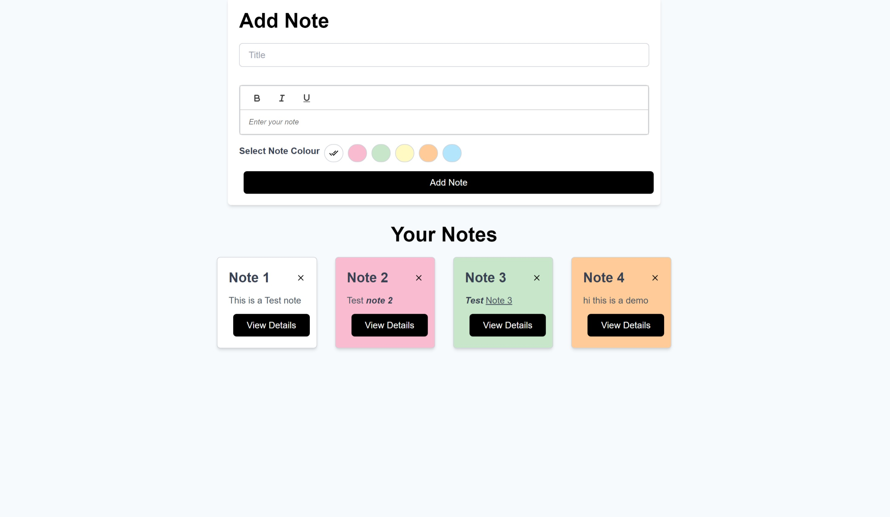
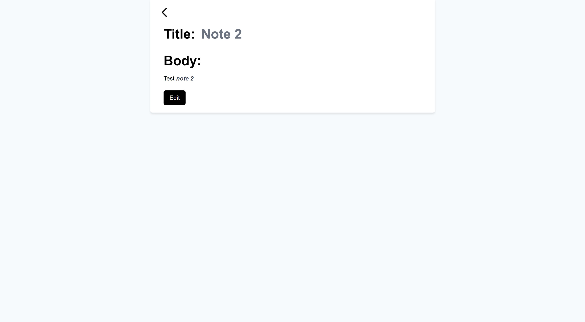
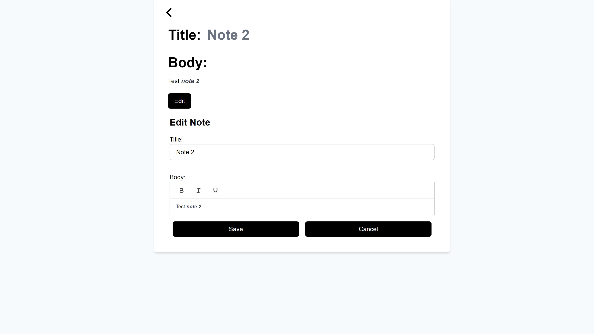
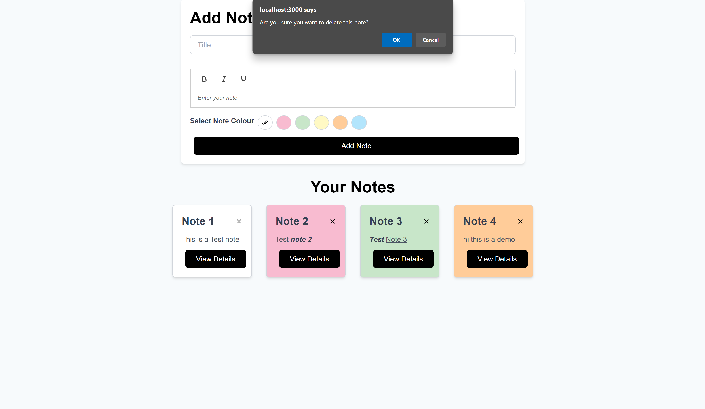

# Mind Memo - Note Making App

Mind Memo is a simple and intuitive note-making app that allows you to create, organize, and manage your notes effectively. With a clean and user-friendly interface, Mind Memo helps you keep your thoughts organized and accessible.

## Features

### Note Creation

- **Create New Note:**

  - Implement a feature to create a new note with a title and body text.
  - Choose from a variety of colors to personalize your note cards.

  

- **Text Formatting:**
  - Include basic text formatting options such as bold, italic, and underline using the React Quill editor.

### List of Notes

- **Display and Organize:**
  - Display a list of notes with their titles and a snippet of the body text for quick reference.

### View Full Note

- **View and Edit:**

  - Provide an option to view the full note in a separate view or modal using the specific note ID.

  

### Edit and Delete

- **Customize and Manage:**

  - Allow users to edit or delete their notes for easy customization.

  

- **Confirmation Prompts:**

  - Implement confirmation prompts for deleting notes to prevent accidental deletion.

  

### State Management with Redux

- **Redux Integration:**
  - Utilize Redux to manage the state of the notes, ensuring a centralized and efficient state management system.

### Local Storage Integration

- **Persistent Storage:**

  - Save the notes in the browser's local storage so that they persist even after the browser is closed.


### Styling with Tailwind CSS

- **Sleek and Modern Design:**
  - Employ Tailwind CSS for styling, giving the app a sleek and modern design.

### Responsive Design

- **Adaptive Layout:**
  - Ensure a responsive design that adapts to various screen sizes, providing a seamless experience on both desktop and mobile devices.

## Getting Started

Follow these steps to get started with Mind Memo:

1. **Clone the repository:**

   ```bash
   git clone https://github.com/your-username/mind-memo.git
   ```

2. **Navigate to the project directory:**

   ```bash
   cd mind-memo
   ```

3. **Install dependencies:**

   ```bash
   npm install
   ```

4. **Run the app:**

   ```bash
   npm start
   ```

5. **Open your browser and visit [http://localhost:3000](http://localhost:3000):**
   - The app should now be running locally.

## Technologies Used

- React
- Redux
- React Quill
- Tailwind CSS

## Contributing

Contributions are welcome! Feel free to open issues or submit pull requests to improve Mind Memo.
